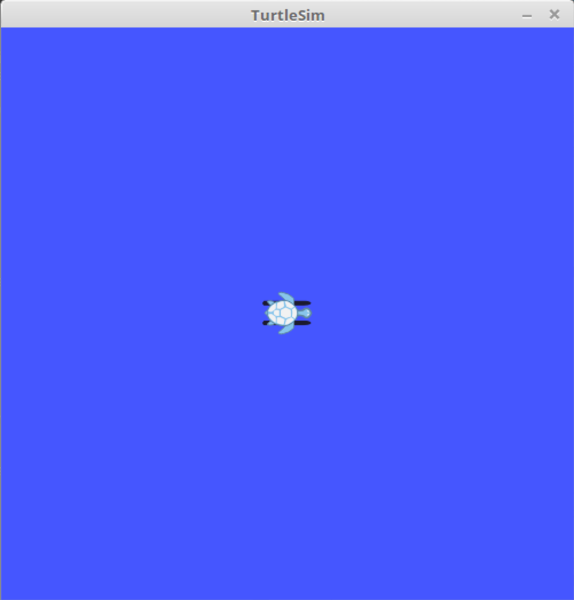
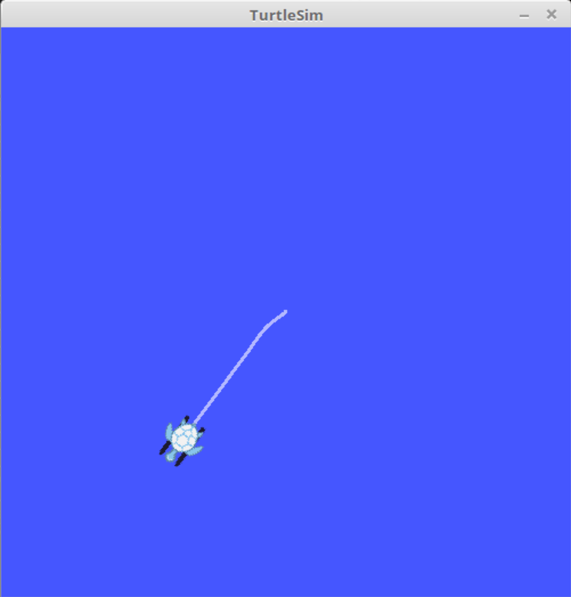
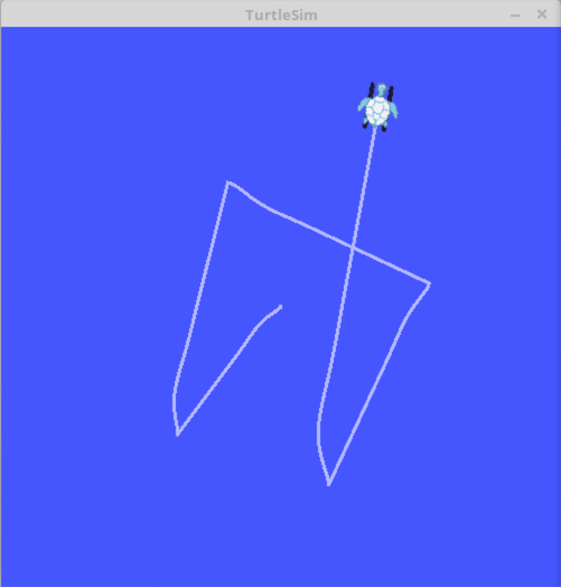

# __Point-to-point control__

### _Author_: Livio Bisogni
###### __&copy; 2021 Turtley & Turtles Ltd.__
___
I'll take you where no one's ever turtled before.

## Prerequisites

* [ROS](http://wiki.ros.org/ROS/Installation) - An open-source, meta-operating system for your robots. Repository tested only under ROS Kinetic, though.

## How to compile
1. Move this folder (`point-to-point-control`) in `~/catkin_ws/src` (or wherever thy ROS workspace is).
2. Launch a terminal window and navigate to the aforementioned ROS workspace, e.g.,

	```
	$ cd ~/catkin_ws/
	```
3. Build the package:

	```
	$ catkin_make
	```

## How to execute
Open the terminal and type:

```
$ roslaunch point_to_point_control point_to_point_control.launch
```

## How to use

1. A goal pose (goalPose\_X, goalPose\_Y) is passed by terminal thanks to the following command:

	```
	$ rostopic pub /turtle1/PositionCommand geometry_msgs/Pose2D '{x: goalPose_X, y: goalPose_Y}' -1
	```
where:	0 &leq; goalPose\_X, goalPose\_Y  &leq; 11

2. Given a goal pose, the turtle moves towards it using a proportional controller.
3. Once that pose is reached, the turtle stops; it can move towards another desired pose (passed by the user as shown in point 1), and so forth.
4. Poses out of bounds are properly treated. Various types of information are printed on the terminal. Press `ESC` to exit the program anytime.

## Some _turtlish_ screenshots

* Initial position:



* Turtle is moving towards the first pose (decided by the user and passed by a terminal window):



* 5-th pose reached:


